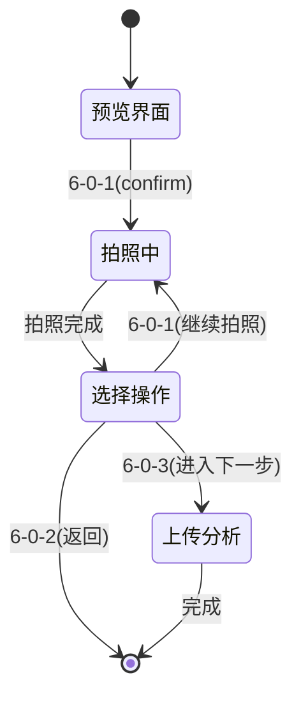

# 摄像头超时和交互式拍照流程修复

## 解决的问题

### 1. 摄像头超时错误
**错误信息：**
```
[ WARN:0@66.199] global cap_v4l.cpp:1048 tryIoctl VIDEOIO(V4L2:/dev/video4): select() timeout.
```

**问题分析：**
- 摄像头读取数据时发生超时
- V4L2驱动层面的select()调用超时
- 可能由摄像头占用、配置错误或硬件问题引起

### 2. 拍照流程不符合用户需求
**原有流程：**
一次性拍摄多张照片，用户无法控制

**期望流程：**
1. 用户预览界面
2. 按确认拍第一张
3. 拍完后继续预览，用户选择：
   - 继续拍照
   - 进入下一步（上传分析）

## 修复方案

### 1. 摄像头超时修复

#### 1.1 超时读取机制
添加了带超时和重试的帧读取方法：

```python
def _read_frame_with_timeout(self, camera, camera_name: str, max_attempts: int = 10, timeout_per_attempt: float = 2.0):
    """
    带超时和重试的帧读取方法
    使用线程避免阻塞，支持多次重试
    """
```

**特性：**
- 使用线程读取避免主线程阻塞
- 可配置重试次数和超时时间
- 详细的日志记录

#### 1.2 摄像头预热机制
在摄像头初始化时添加预热：

```python
# 预热摄像头，读取几帧丢弃
logger.info(f"预热拍照摄像头 {self.photo_camera_index}...")
for i in range(5):
    ret, frame = self.photo_camera.read()
    if ret:
        logger.info(f"预热第{i+1}帧成功")
        break
    time.sleep(0.2)
```

#### 1.3 改进的摄像头配置
- 设置更合适的缓冲区大小：`CAP_PROP_BUFFERSIZE = 1`
- 使用MJPG编码：`CAP_PROP_FOURCC = MJPG`
- 添加资源释放等待时间

### 2. 交互式拍照流程

#### 2.1 新增状态管理
```python
# 拍照流程控制
self.photo_count = 0  # 已拍照数量
self.waiting_for_photo_action = False  # 等待拍照操作选择
```

#### 2.2 MQTT指令扩展
- `6-0-1` (confirm)：拍照/继续拍照
- `6-0-3` (next)：进入下一步（上传分析）
- `6-0-2` (back)：返回

#### 2.3 流程状态机



## 修改的文件

### 1. camera_handler.py
- 添加 `_read_frame_with_timeout()` 方法
- 改进 `_release_camera_if_needed()` 方法
- 修改 `capture_photos_for_homework()` 使用超时读取
- 添加摄像头预热机制

### 2. photo_homework_handler.py
- 添加拍照状态管理
- 修改MQTT指令处理支持新流程
- 修改 `_on_photo_captured()` 支持交互式选择
- 添加 `waiting_for_photo_action` 状态

### 3. test_interactive_photo.py
- 新增测试脚本验证修复效果
- 测试超时读取机制
- 测试交互式拍照流程
- 模拟MQTT指令测试

## 使用方法

### 新的拍照流程
1. **启动拍照界面**：用户看到摄像头预览
2. **第一次拍照**：按 `6-0-1` 拍第一张照片
3. **拍照成功后**：
   - 系统显示："拍照成功！已拍摄 X 张照片"
   - 继续显示预览界面
   - 等待用户选择下一步操作
4. **用户选择**：
   - 按 `6-0-1`：继续拍照（重复步骤2-4）
   - 按 `6-0-3`：进入上传分析阶段
   - 按 `6-0-2`：返回上级界面

### 测试修复效果
```bash
# 测试所有修复
python test_interactive_photo.py

# 测试原有功能
python test_camera_fixes.py
```

### 故障排除

#### 摄像头超时问题
1. **检查摄像头占用**：
   ```bash
   lsof /dev/video*
   ```

2. **检查摄像头状态**：
   ```bash
   v4l2-ctl --list-devices
   v4l2-ctl --device=/dev/video4 --info
   ```

3. **调整超时参数**：
   ```python
   # 在camera_handler.py中修改
   success, frame = self._read_frame_with_timeout(
       camera, camera_name,
       max_attempts=10,        # 增加重试次数
       timeout_per_attempt=5.0  # 增加单次超时时间
   )
   ```

#### 拍照流程问题
1. **检查状态**：
   ```python
   # 通过日志查看当前状态
   logger.info(f"拍照数: {handler.photo_count}")
   logger.info(f"等待拍照操作: {handler.waiting_for_photo_action}")
   ```

2. **重置流程**：
   发送 `6-0-2` (back) 指令重置流程状态

## 技术细节

### 超时读取实现
使用Python threading和queue实现带超时的摄像头读取：

```python
def read_frame(q, cam):
    """在线程中读取帧"""
    try:
        ret, frame = cam.read()
        q.put((ret, frame))
    except Exception as e:
        q.put((False, None))

# 在主线程中等待结果或超时
frame_queue = Queue()
read_thread = threading.Thread(target=read_frame, args=(frame_queue, camera))
read_thread.start()

try:
    ret, frame = frame_queue.get(timeout=timeout_per_attempt)
except Empty:
    logger.warning("读取帧超时")
```

### 状态管理
使用多个布尔标志管理复杂的交互状态：

```python
self.waiting_for_photo_signal = False    # 等待拍照信号
self.waiting_for_photo_action = False    # 等待拍照后的操作选择
self.waiting_for_upload_signal = False   # 等待上传信号
```

### MQTT指令路由
根据当前状态和指令类型进行不同处理：

```python
if self.waiting_for_photo_action and command == 'confirm':
    # 继续拍照
elif self.waiting_for_photo_action and command == 'next':
    # 进入下一步
elif self.waiting_for_photo_signal and command == 'confirm':
    # 开始拍照
```

## 配置参数

可以通过以下参数调整行为：

```python
# 超时配置
max_attempts = 10              # 最大重试次数
timeout_per_attempt = 2.0      # 单次超时时间（秒）

# 摄像头配置
CAP_PROP_BUFFERSIZE = 1        # 缓冲区大小
预热帧数 = 5                   # 预热时读取的帧数

# 拍照流程配置
无需清除旧照片 = True           # 支持累积拍照
```

## 兼容性说明

- 保持向后兼容原有的单次拍照功能
- 模拟模式和真实摄像头模式都支持
- 原有的错误处理机制继续有效
- 所有现有的MQTT指令继续工作

## 注意事项

1. **资源管理**：摄像头使用后会自动释放资源
2. **错误恢复**：支持摄像头错误后的自动重启
3. **日志监控**：详细日志帮助诊断问题
4. **性能优化**：超时机制避免无限等待

通过这些修复，系统现在能够：
- ✅ 处理摄像头超时问题
- ✅ 支持交互式拍照流程
- ✅ 提供更好的错误恢复机制
- ✅ 保持良好的用户体验 