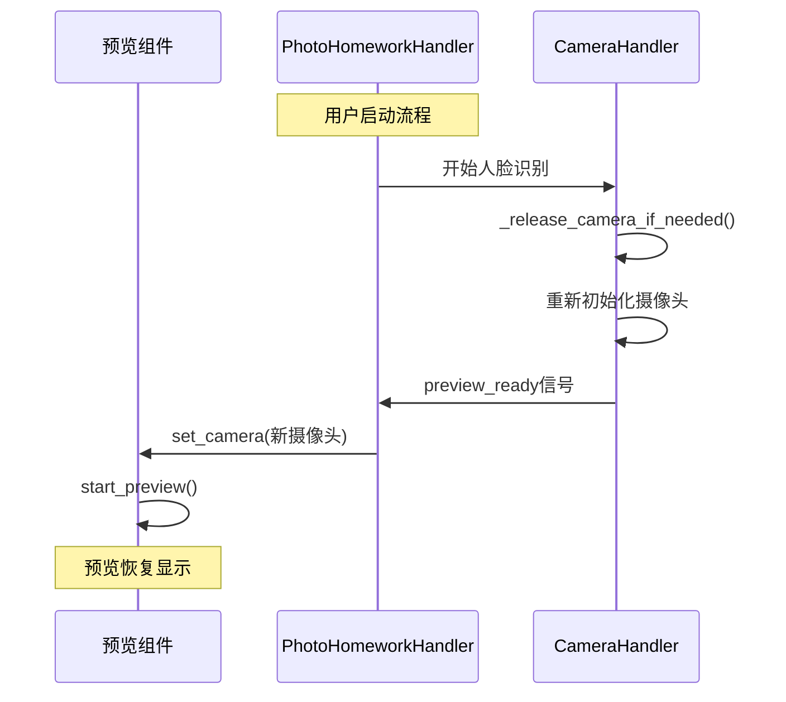

# 预览画面和MQTT意外触发修复

## 解决的问题

### 1. 预览没有画面的问题

**问题描述：**
- 人脸识别摄像头的预览界面显示"摄像头准备中..."但没有实际画面
- 摄像头在进行人脸识别时会被重新初始化，导致预览组件失去连接

**问题根因：**
1. 摄像头在拍照前会调用 `_release_camera_if_needed()` 方法重新初始化
2. 重新初始化后，预览组件仍然持有旧的摄像头对象引用
3. 预览组件无法感知摄像头已被重新初始化，因此无法显示新的画面

### 2. 一进去就拍照的问题

**问题描述：**
- 系统启动后立即收到MQTT confirm指令并开始拍照
- 用户没有手动发送确认信号，但系统自动开始了人脸识别流程

**问题根因：**
1. MQTT响应延迟机制（3秒）可能不够长
2. 缺乏额外的安全检查机制防止意外指令处理
3. 可能存在重复的信号连接或意外触发

## 修复方案

### 1. 预览画面修复

#### 1.1 添加预览就绪信号机制

在 `camera_handler.py` 中：
```python
# 信号定义
preview_ready = pyqtSignal(str, object)  # 预览准备就绪信号 (类型, 摄像头对象)

# 在摄像头重新初始化后发送信号
def _release_camera_if_needed(self, camera_type: str):
    # ... 重新初始化摄像头 ...
    if success:
        # 发送预览就绪信号，通知UI组件更新摄像头引用
        self.preview_ready.emit(camera_type, new_camera_object)
```

#### 1.2 预览组件管理机制

在 `photo_homework_handler.py` 中：
```python
# 添加预览组件管理
self.current_preview_widget = None

def _on_preview_ready(self, camera_type: str, camera_object):
    """处理摄像头预览就绪信号"""
    if self.current_preview_widget:
        self.current_preview_widget.set_camera(camera_object)
        if hasattr(self.current_preview_widget, 'start_preview'):
            self.current_preview_widget.start_preview()

def set_preview_widget(self, preview_widget):
    """设置当前预览组件"""
    self.current_preview_widget = preview_widget
```

#### 1.3 预览组件连接

预览组件现在能够：
- 在摄像头重新初始化后自动获得新的摄像头对象
- 自动重新启动预览
- 保持与实际摄像头状态的同步

### 2. MQTT意外触发修复

#### 2.1 延长响应延迟时间

```python
# 从3秒延长到5秒
QTimer.singleShot(5000, self._enable_mqtt_response)
```

#### 2.2 添加多层安全检查

```python
def _on_mqtt_command(self, command: str):
    # 第一层：MQTT响应是否已启用
    if not self.mqtt_ready:
        return
    
    # 第二层：系统状态检查
    if not self.is_processing and command != 'back':
        return
    
    # 第三层：流程阶段验证
    if self.is_processing and self.current_stage is None and command != 'back':
        return
    
    # 第四层：添加详细的日志记录
    logger.info(f"开始执行{action} (重试次数: {self.retry_count})")
```

#### 2.3 改进状态管理

- 添加更详细的状态检查日志
- 对未匹配的指令进行警告记录
- 确保只有有效状态下才处理指令

## 修改的文件

### 1. camera_handler.py
- 修改 `_release_camera_if_needed()` 方法，添加预览就绪信号发送
- 确保摄像头重新初始化后通知预览组件

### 2. photo_homework_handler.py
- 添加预览组件管理机制
- 连接 `preview_ready` 信号
- 增加MQTT响应延迟时间（3秒→5秒）
- 添加多层安全检查机制
- 改进日志记录

### 3. test_preview_fixes.py
- 新增可视化测试工具
- 验证预览和MQTT修复效果
- 提供手动测试界面

## 使用方法

### 测试修复效果

运行可视化测试工具：
```bash
python test_preview_fixes.py
```

测试步骤：
1. **启动测试**：运行脚本，等待6秒直到按钮启用
2. **预览测试**：检查预览窗口是否显示摄像头画面
3. **学校模式测试**：
   - 点击"开始学校模式"
   - 等待预览切换到人脸识别摄像头
   - 点击"发送确认信号"进行人脸识别
   - 观察预览是否在重新初始化后恢复
4. **家庭模式测试**：
   - 点击"开始家庭模式"
   - 检查预览是否显示拍照摄像头
   - 测试交互式拍照流程

### 验证修复效果

✅ **预览画面修复验证**：
- 启动后预览窗口应该显示摄像头画面
- 人脸识别后预览应该自动恢复显示
- 模式切换时预览应该正确切换摄像头

✅ **MQTT意外触发修复验证**：
- 启动后5秒内按钮应该是禁用状态
- 不会收到意外的MQTT指令处理
- 只有在手动点击按钮后才会开始流程

## 技术细节

### 信号流程图



### 安全检查层级

1. **时间层**：5秒延迟启用MQTT响应
2. **状态层**：检查 `is_processing` 状态
3. **阶段层**：验证 `current_stage` 有效性
4. **指令层**：只处理匹配的指令类型
5. **日志层**：记录所有操作便于调试

### 预览更新机制

```python
# 摄像头重新初始化时自动更新预览
摄像头重新初始化 → preview_ready信号 → 预览组件更新 → 重启预览
```

## 兼容性说明

- 保持所有现有功能不变
- 向后兼容原有的预览机制
- 不影响现有的MQTT指令处理
- 模拟模式和真实摄像头模式都支持

## 故障排除

### 预览仍然没有画面

1. **检查摄像头状态**：
   ```bash
   v4l2-ctl --list-devices
   lsof /dev/video*
   ```

2. **检查日志输出**：
   - 查找 "预览就绪信号" 日志
   - 确认摄像头重新初始化成功
   - 验证预览组件收到更新

3. **手动测试**：
   使用测试脚本验证预览更新机制

### MQTT仍然意外触发

1. **检查延迟机制**：
   - 确认看到 "MQTT响应已启用" 日志
   - 验证5秒延迟是否生效

2. **检查信号连接**：
   - 确认没有重复的信号连接
   - 检查是否有其他地方触发MQTT处理

3. **增加延迟时间**：
   如果5秒不够，可以调整为更长时间

## 注意事项

1. **资源管理**：预览组件会自动管理摄像头资源
2. **性能影响**：预览更新机制开销很小
3. **线程安全**：所有信号处理都在主线程中进行
4. **错误恢复**：预览组件支持摄像头错误后的自动恢复

通过这些修复，系统现在能够：
- ✅ 正确显示摄像头预览画面
- ✅ 在摄像头重新初始化后自动恢复预览
- ✅ 防止启动时的意外MQTT指令触发
- ✅ 提供更稳定的用户交互体验 